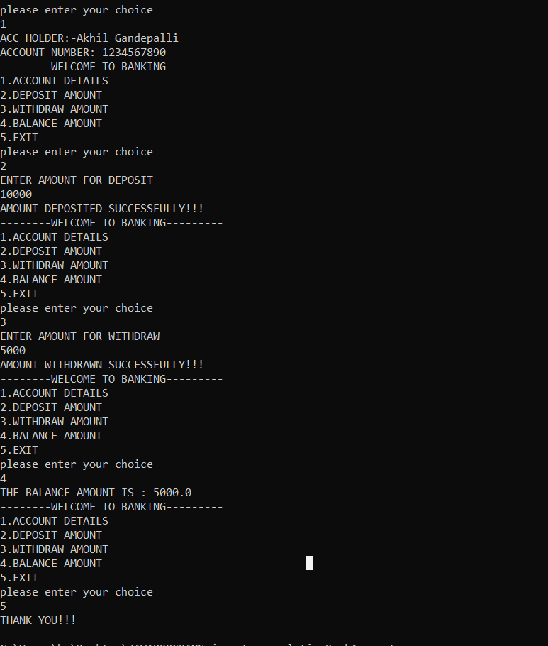

# Banking Account Management

This project is a **menu-driven Bank Account Management System** built in **Java** using the principle of **Encapsulation**.  
It allows users to create an account, deposit money, withdraw money (with validation), check balance, and view account details.  
The project demonstrates **getter/setter methods, input validation, and OOP practices** in a simple console-based program.

---

## 📸 Sample Output
Here is a screenshot of the program running:

